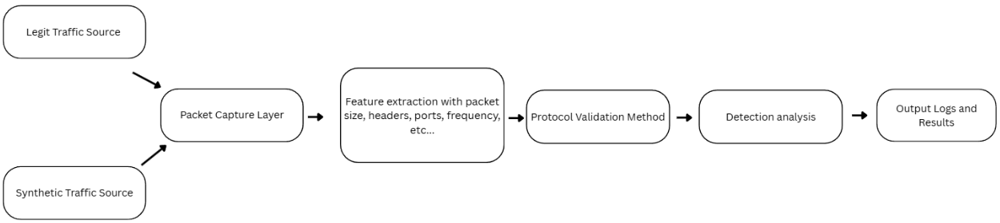

# Protocol Impersonation Detection System

CECS 478 — Final Project | Dylan Hartley

[](https://github.com/djakobh/CECS478-Final-Project/actions/workflows/ci.yml)

---

## Overview
This project detects protocol impersonation attacks where malicious traffic is used to disguise themselves as legit network traffic to get by detection systems. It analyzes PCAP files and flags traffic that doesn't behave consistently with the protocol it says it is.


---

## Architecture
**Vertical slice:** `traffic_gen` → `capture.pcap` → `feature_extract` → `http_validator` /
`dns_validator` → `detector` → `results`



**Components:**

| File | Role |
|---|---|
| `src/traffic_gen.c` | Generates synthetic pcap (legit + malicious packets) |
| `src/feature_extract.c` | Parses raw Ethernet/IP/TCP/UDP frames |
| `src/http_validator.c` | Validates HTTP method, version, Host header, port |
| `src/dns_validator.c` | Validates DNS header structure, QDCOUNT, port |
| `src/detector.c` | Classifies packets, accumulates TP/FP/TN/FN |
| `src/metrics.c` | Exports per-packet CSV and summary JSON |
| `src/logger.c` | Timestamped per-packet log |

---

## Quick Start

Requirements: **Docker**, **Docker Compose v2**, **Make**

```bash
git clone https://github.com/djakobh/CECS478-Final-Project.git
cd CECS478-Final-Project
make clean && make up && make demo
```

Full rebuild completes in under 5 minutes on a fresh clone.

---

## All Make Targets

| Target | Description |
|---|---|
| `make up` | Build Docker image + generate synthetic pcap |
| `make demo` | Run detector pipeline, print results to stdout |
| `make test` | Run all unit tests inside the container |
| `make coverage` | Build with gcov, run tests, print coverage summary |
| `make clean` | Remove containers, images, and volumes |

---

## Output Artifacts

After make demo:

| File | Description |
|---|---|
| `artifacts/release/results.log` | Timestamped per-packet log |
| `artifacts/release/metrics.csv` | Per-packet verdict table |
| `artifacts/release/summary.json` | Aggregate metrics (detection rate, FP rate, accuracy) |

---

## Security Invariants

- All code runs as a non-root user (`appuser`) inside the container
- Pcap path is validated — rejects `..` traversal and paths outside `data/`
- Raw payload bytes are never written to log files
- Synthetic traffic is localhost-only - `127.0.0.1`
- Packet generation is bounded by `MAX_PACKETS = 1000`

See [docs/security-invariants.md](docs/security-invariants.md) for full details.

---

## Documentation

- [docs/runbook.md](docs/runbook.md) — Rebuild and run instructions
- [docs/security-invariants.md](docs/security-invariants.md) — Security guarantees
- [docs/what-works-whats-next.md](docs/what-works-whats-next.md) — Status and roadmap
- [docs/results-draft.md](docs/results-draft.md) — Initial evaluation results
- [docs/CECS 478 Final Report.pdf](docs/CECS%20478%20Final%20Report.pdf) - Final Report as a PDF 

---

## Success Metrics

| Metric | Target | Initial Result |
|---|---|---|
| Detection rate | ≥ 85% | 100% (synthetic dataset) |
| False positive rate | ≤ 15% | 0% (synthetic dataset) |
| Processing time | ≤ 5 seconds | 23.58 ms |

---

## Final Demo Video (Code Execution)

[](https://www.youtube.com/watch?v=BSGneJ2-8zE)
 
---

## Project Structure

```
src/                    # C source — all pipeline modules
tests/                  # Unit tests + run_tests.sh
docker/                 # Dockerfile
docs/                   # Runbook, security invariants, results, roadmap
artifacts/release/      # Evidence artifacts (pcap, log, metrics, summary)
data/                   # Runtime pcap + ground truth (generated by make up)
.github/workflows/      # CI pipeline
```
